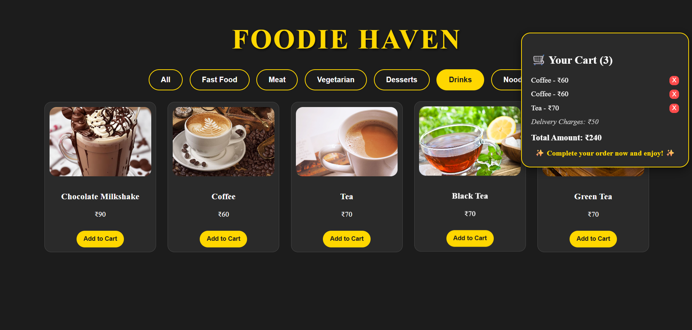
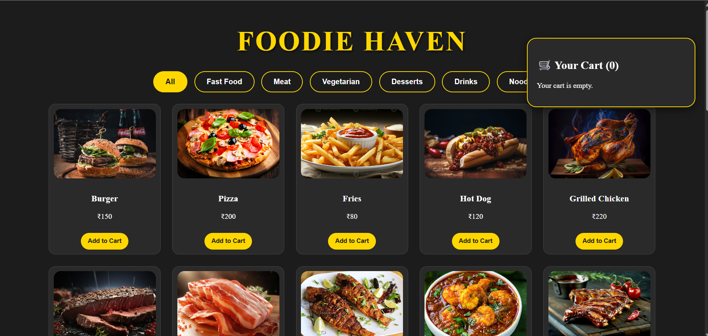
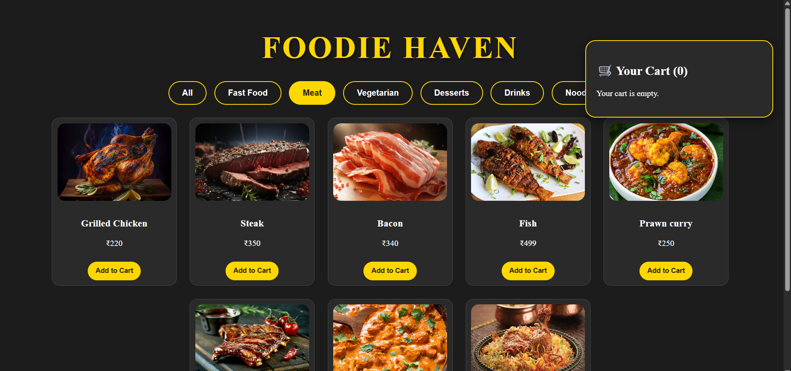
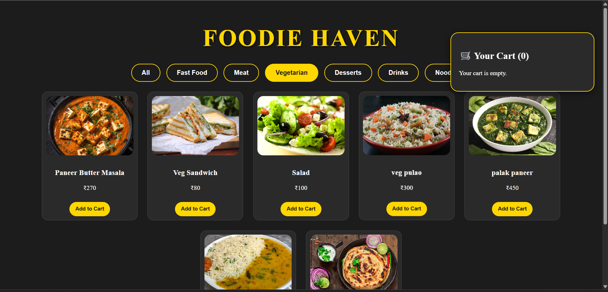
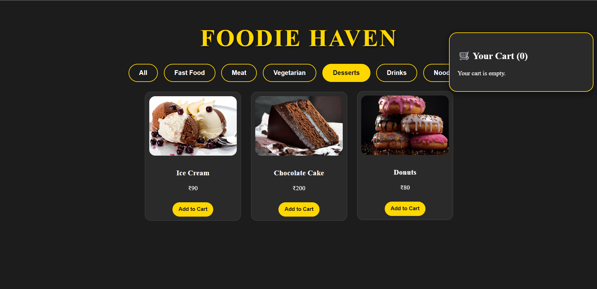

# Food Delivery App 🍔🍕🥗

A modern **React frontend** for a Food Delivery application with elegant UI and cart functionality.








## Live Demo
Check out the live demo here: [Food Delivery App](https://food-delivery-liart-nine.vercel.app/)

---

## Features
- Browse foods by category: Fast Food, Vegetables, Fruits, Non-Veg
- Add items to the cart
- View total price with delivery charges
- Responsive and elegant design with smooth hover effects
- Easy to extend for backend integration

---

## Technologies Used
- React.js
- CSS for styling (No Tailwind or other frameworks)
- JavaScript (ES6+)
- Optional: Vercel for live deployment

---

## How to Run Locally

1. Clone the repo:

```bash
git clone https://github.com/M-Nethravathi/food-delivery.git
